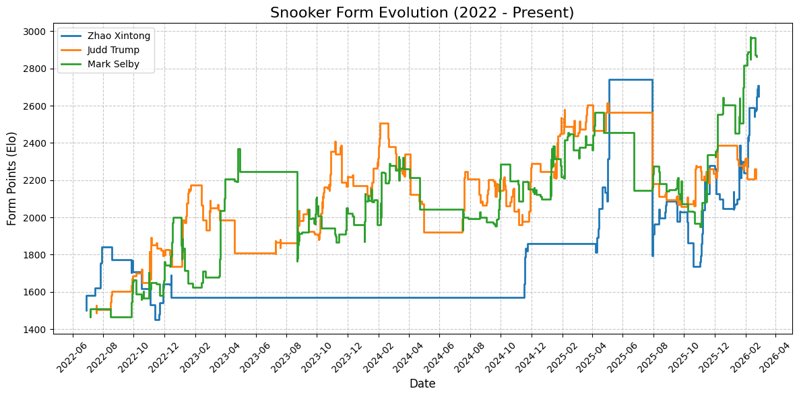

# Snooker Player Data Analytics

## New ELO-inspired scoring to reflect latest forms and strength

### Option 1

See `JsonProcessor.java` in `src/main/java`

In this approach, apart from typical ELO, recent abilities to make 70+ breaks are taken into consideration. Average score for all players is 1500.

#### ELO is handle on frame level

For a Match between player1 and player2, we have expected frame win rate for player1 as: 

$$P_{1,2} = \frac{1}{1+e^{(S_1-S_2)/400}}$$

Where $S_1$ and $S_2$ are the scores of player1 and player2 respectively. After a match, the scores are updated as:

$$S_1' = S_1 + K \cdot (F_1 - T_{1,2} \cdot P_{1,2})$$

$$S_2' = S_2 + K \cdot (F_2 - T_{2,1} \cdot P_{2,1})$$

Where:
- $F_1$ and $F_2$ are the actual frame wins for player1 and player2 respectively
- $T_{1,2} = T_{2,1} = F_1 + F_2$ is the total frames played in the match
- $P_{2,1} = 1 - P_{1,2}$ is the expected frame win rate for player2 against player1
- $K$ is a constant that determines the sensitivity of score updates

This so far is standard frame-wise ELO, satisfying the **_Zero-Sum_** property, meaning the total score of both players remains constant after a match, because:

$$T_{1,2} = T_{2,1} = F_1 + F_2$$
$$P_{2,1} + P_{1,2} = 1$$

#### Count of 70+ breaks is introduced

$$S_1'' = S_1' + M \cdot (B_1 - G \cdot F_1) $$
$$S_2'' = S_2' + M \cdot (B_2 - G \cdot F_2) $$

Where:
- $B_1$ and $B_2$ are the counts of 70+ breaks for player1 and player2 respectively
- $G$, usually around 0.31-0.33, is the season global average of 70+ breaks per frame, calculated as total 70+ breaks divided by total frames in the season
- $M$ is a constant that determines the weight of 70+ breaks in the score

Now the **_Zero-Sum_** property is no longer satisfied on the match level, since two players could play both well (many 70+) or bad and therefore have both positive or negative changes in scores.

However, on a season level, the average score of all players remains constant, because we compared player's match performance against the seasonal average 70+ breaks per frame, and the total 70+ breaks and total frames are fixed for the season, and therefore the total score change from 70+ breaks across all players will sum to zero.

#### Option 1 score prior to 2026 World Open last 64:

| Rank | Player Name | Latest Score |
|------|-------------|--------------|
| 1 | Zhao Xintong | 2398.5066744347946 |
| 2 | Mark Selby | 2370.5806561103727 |
| 3 | Judd Trump | 2320.0653570287004 |
| 4 | Wu Yize | 2315.940719600528 |
| 5 | Chang Bingyu | 2285.965765199921 |
| 6 | John Higgins | 2256.508765091676 |
| 7 | Kyren Wilson | 2228.361788678453 |
| 8 | Mark Allen | 2220.354388139406 |
| 9 | Barry Hawkins | 2183.435007415537 |
| 10 | Zhou Yuelong | 2179.110499351137 |
| 11 | Shaun Murphy | 2170.4726804960173 |
| 12 | Ronnie O'Sullivan | 2115.0111422234504 |
| 13 | Jack Lisowski | 2101.390272197272 |
| 14 | Xiao Guodong | 2101.2896592028715 |
| 15 | Elliot Slessor | 2084.99591284336 |
| 16 | Neil Robertson | 2075.613066106403 |
| 17 | Zhang Anda | 2048.9698328524546 |
| 18 | Jak Jones | 2028.0802825345447 |
| 19 | Ding Junhui | 2024.848272351529 |
| 20 | Chris Wakelin | 2019.1054502422323 |
| 21 | Sam Craigie | 1983.0888148893737 |
| 22 | Ali Carter | 1980.599818049654 |
| 23 | Jiang Jun | 1971.5961971969623 |
| 24 | Jimmy Robertson | 1950.587442333574 |
| 25 | Matthew Selt | 1949.349017943028 |
| 26 | Mark Williams | 1947.4905333842332 |
| 27 | Stan Moody | 1924.6564586443733 |
| 28 | Gary Wilson | 1911.9734931012777 |
| 29 | Xu Si | 1911.700240649308 |
| 30 | Stuart Bingham | 1903.7063462892063 |
| 31 | Si Jiahui | 1901.20132804355 |
| 32 | Tom Ford | 1898.5373586371632 |

#### A demonstration of Score evolution since 2022/2023 season for Judd Trump, Zhao Xintong and Mark Selby:

### Option 3

See `JsonProcessorO3.java` in `src/main/java`

The main problem for Option 1 is that the number of total frames in a match is not fixed.

#### Expected Number of Frames won

Option3 calculates the expected number of frames won by players. For a scenario when player 1 wins k frames and player 2 wins r frames, the probability of this scenario is calculated as:

$$P(F_1=k,F_2=r,k \gt r) = \binom{k+r-1}{r} \cdot P_{1,2}^k \cdot P_{2,1}^r$$

$$P(F_1=k,F_2=r,k \lt r) = \binom{k+r-1}{k} \cdot P_{1,2}^k \cdot P_{2,1}^r$$

Where $P_{1,2}$ and $P_{2,1}$ are the expected frame win rates for player1 and player2 respectively, calculated as in Option 1.

Considering all scenarios, the expected number of frames won by player1 and player 2 are:

$$E[F_1] = \sum_{k}{} \sum_{r}^{} k \cdot P(F_1=k,F_2=r)$$
$$E[F_2] = \sum_{k}{} \sum_{r}^{} r \cdot P(F_1=k,F_2=r)$$

Then the score updates are calculated as:

$$S_1' = S_1 + K \cdot (F_1-E[F_1])$$
$$S_2' = S_2 + K \cdot (F_2-E[F_2])$$

In this case, there is no match level zero-sum property. Take example of a match where Zhao Xintong best an amateur player 4-3:

- Option 1 would deduct Zhao's score because he has about 90+\% expected frame win rate but only won 4 out of 7
- Option 3 would increase Zhao's score slightly because he won more frames than expected (but very close to 4)
- Both options would increase the amateur player's score significantly because he won much more frames than expected

Therefore, we need a solution to balance out the inlfation of scores caused by Option 3, introducing:

#### Score Decay and Recovery

For a match on day $t$ for a player. Check their last match's date $t'$, if $\Delta t=t-t'>7$, it triggers decay or recovery before we evaluate the matches expected number of frames won by players.

- if the player's current score is below 1500 and their historical highest score, we "recover" their score by an amount proportional to $\Delta t$ and the difference between current score and historical highest, with a maximum cap.
- else, if the player's current score is above its historical average score, we "decay" their score by an amount proportional to $\Delta t$ and the difference between the current score and the historical average, with a maximum cap.

By adjusting the hyperparameters of decay and recovery, we can control the overall inflation of scores caused by Option 3, keeping the overall average around 1500.

This "decay and recovery" mechanism also helps to reflect players' current forms more accurately, as elite players who have been inactive for a while will have their skills regressed towards their average, and players with lower scores will recover from the break.

A important note to this method is that an initialization of players' estimated scores are recommended (or a burn-in period), otherwise the historical average would not be accurate.

#### Option 3 score prior to 2026 World Open last 64:

| Rank | Player Name | Latest Score |
|------|-------------|--------------|
| 1 | Mark Selby | 2865.6868239845558 |
| 2 | Zhao Xintong | 2652.74754370146 |
| 3 | Wu Yize | 2467.597877400968 |
| 4 | John Higgins | 2318.102762416399 |
| 5 | Mark Allen | 2291.5857023525573 |
| 6 | Judd Trump | 2208.705516886706 |
| 7 | Barry Hawkins | 2184.6036158369825 |
| 8 | Chang Bingyu | 2139.4210022623374 |
| 9 | Xiao Guodong | 2130.82552243875 |
| 10 | Elliot Slessor | 2129.9864474229803 |
| 11 | Jack Lisowski | 2119.367062947844 |
| 12 | Kyren Wilson | 2078.7620434951923 |
| 13 | Zhang Anda | 2078.157006826138 |
| 14 | Shaun Murphy | 2058.7845276456887 |
| 15 | Ronnie O'Sullivan | 2054.3499753515403 |
| 16 | Chris Wakelin | 2020.273674187509 |
| 17 | Zhou Yuelong | 2009.9265162210056 |
| 18 | Ali Carter | 1973.0984023025328 |
| 19 | Neil Robertson | 1963.267107903007 |
| 20 | Si Jiahui | 1958.1283994608011 |
| 21 | Matthew Selt | 1957.443044535168 |
| 22 | Ding Junhui | 1915.2586120218864 |
| 23 | Tom Ford | 1903.4788977903556 |
| 24 | Jak Jones | 1903.325046838377 |
| 25 | Sam Craigie | 1893.4388243535284 |
| 26 | Jiang Jun | 1887.581199702366 |
| 27 | Stuart Bingham | 1861.785727772074 |
| 28 | David Gilbert | 1853.3490956902776 |
| 29 | Mark Williams | 1832.6795532611088 |
| 30 | Yan Bingtao | 1830.5272529965732 |
| 31 | Joe O'Connor | 1825.105239596452 |
| 32 | Pang Junxu | 1814.0966478120856 |

#### A demonstration of Score evolution since 2022/2023 season for Judd Trump, Zhao Xintong and Mark Selby:

#### Prediction for 2026 World Open last 64:

## Recent seasons WST data in json style

see `season_xxxx-xxxx.json` and `SnookerCrawler.java`

## Win rates of matches between seasonal top-32 players in 2025/2026 WST

see `SnookerStats.java` and `rates_ranking.png`

source: 

- For rankings: [snooker.org](https://www.snooker.org/res/index.asp?template=33&season=2025)
- For matches results: [cuetracker.net](https://cuetracker.net/seasons/2025-2026)
