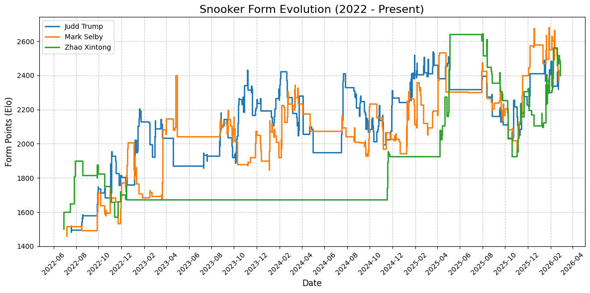

# Snooker Player Data Analytics

## New ELO-inspired scoring to reflect latest forms and strength

see `JsonProcessor.java`

apart from typical ELO, recent abilities to make 70+ breaks are taken into consideration. Average score for all players is 1500.

### My score prior to 2026 World Open last 64:

| Rank | Player Name | Latest Score |
|------|-------------|--------------|
| 1 | Zhao Xintong | 2398.5066744347946 |
| 2 | Mark Selby | 2370.5806561103727 |
| 3 | Judd Trump | 2320.0653570287004 |
| 4 | Wu Yize | 2315.940719600528 |
| 5 | Chang Bingyu | 2285.965765199921 |
| 6 | John Higgins | 2256.508765091676 |
| 7 | Kyren Wilson | 2228.361788678453 |
| 8 | Mark Allen | 2220.354388139406 |
| 9 | Barry Hawkins | 2183.435007415537 |
| 10 | Zhou Yuelong | 2179.110499351137 |
| 11 | Shaun Murphy | 2170.4726804960173 |
| 12 | Ronnie O'Sullivan | 2115.0111422234504 |
| 13 | Jack Lisowski | 2101.390272197272 |
| 14 | Xiao Guodong | 2101.2896592028715 |
| 15 | Elliot Slessor | 2084.99591284336 |
| 16 | Neil Robertson | 2075.613066106403 |
| 17 | Zhang Anda | 2048.9698328524546 |
| 18 | Jak Jones | 2028.0802825345447 |
| 19 | Ding Junhui | 2024.848272351529 |
| 20 | Chris Wakelin | 2019.1054502422323 |
| 21 | Sam Craigie | 1983.0888148893737 |
| 22 | Ali Carter | 1980.599818049654 |
| 23 | Jiang Jun | 1971.5961971969623 |
| 24 | Jimmy Robertson | 1950.587442333574 |
| 25 | Matthew Selt | 1949.349017943028 |
| 26 | Mark Williams | 1947.4905333842332 |
| 27 | Stan Moody | 1924.6564586443733 |
| 28 | Gary Wilson | 1911.9734931012777 |
| 29 | Xu Si | 1911.700240649308 |
| 30 | Stuart Bingham | 1903.7063462892063 |
| 31 | Si Jiahui | 1901.20132804355 |
| 32 | Tom Ford | 1898.5373586371632 |

### A demonstration of Score evolution since 2022/2023 season for Judd Trump, Zhao Xintong and Mark Selby:

### Prediction for 2026 World Open last 64:

## Recent seasons WST data in json style

see `season_xxxx-xxxx.json` and `SnookerCrawler.java`

## Win rates of matches between seasonal top-32 players in 2025/2026 WST

see `SnookerStats.java` and `rates_ranking.png`

source: 

- For rankings: [snooker.org](https://www.snooker.org/res/index.asp?template=33&season=2025)
- For matches results: [cuetracker.net](https://cuetracker.net/seasons/2025-2026)
